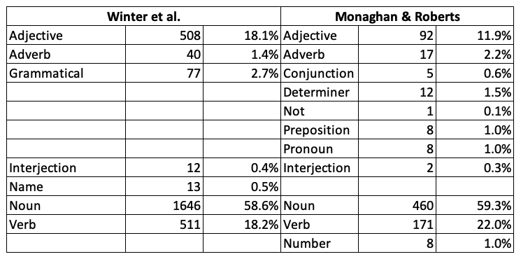

```{r echo=F,eval=F}
try(setwd("~/Box Sync/papersonthego/ICONICITY_LOANWORDS/"))
try(setwd("~/Documents/MPI/MonaghanAoA/Iconicity/"))
```


# Introduction

This file shows the R code for the analyses in *Iconicity and diachronic langauge change*. We show whether a word is borrowed or not can be predicted by its iconicity.

Below is a list of variable names in the data with a short explanation:

-  word: Orthographic form
-  borrowing: variable from WOLD indicating level of evidence for borrowing (1 = definately borrowed, 5 = no evidence of borrowing).
-  bor15, bor15.cat:  Conversion of the WOLD borrowing variable into a numeric (0 = not borrowed, 1 = borrowed).
-  phonology:  Phonological form
-  phonlength:  Number of segments in the phonological form
-  AoA: Age of acquisition ratings from Kuperman, Stadthagen-Gonzalez, and Brysbaert (2012).
-  AoA\_obj: Objective, test-based age of acuqisition from Brysbaert & Biemiller (2017)
-  subtlexzipf:  Log frequency of word from the SUBTLEX database
-  conc:  Concreteness ratings from Brysbaert, Warriner, & Kuperman (2014)
-  cat: Dominant part of speech according to SUBTLEX.
-  age\_oldest, age\_youngest: Dates from WOLD indicating estiamte of data of entry into English.
-  age\_oldest\_num, age\_youngest\_num, age: Conversions into numeric year values for oldest, youngest and average estimate.
-  pagel_rate: Rate of lexical replacement from Pagel, Atkinson & Meade (2007)
-  iconicity: Iconicity rating from Winter et al. (2017). The data actually comes from the supporting materials for Perry et al. (2018), which has slightly more data.
-  systematicity: Systematicity ratings from Monaghan et al. (2014)
-  effect: Whether a word was not borrowed versus different types of borrowing: replacement, coexistence or insertion. Values are NA if there is no information available.

## References

Kuperman, V., Stadthagen-Gonzalez, H., & Brysbaert, M. (2012). Age-of-acquisition ratings for 30,000 English words. Behavior research methods, 44(4), 978-990.

Brysbaert, M., & Biemiller, A. (2017). Test-based age-of-acquisition norms for 44 thousand English word meanings. Behavior research methods, 49(4), 1520-1523.

Brysbaert, M., Warriner, A. B., & Kuperman, V. (2014). Concreteness ratings for 40 thousand generally known English word lemmas. Behavior research methods, 46(3), 904-911.

Pagel, M., Atkinson, Q. D., & Meade, A. (2007). Frequency of word-use predicts rates of lexical evolution throughout Indo-European history. Nature, 449(7163), 717.

Monaghan, P., Lupyan, G., & Christiansen, M. (2014). The systematicity of the sign: Modeling activation of semantic attributes from nonwords. In Proceedings of the Annual Meeting of the Cognitive Science Society (Vol. 36, No. 36).

Winter, B., Perlman, M., Perry, L. K., & Lupyan, G. (2017). Which words are most iconic?. Interaction Studies, 18(3), 443-464.

Perry, L. K., Perlman, M., Winter, B., Massaro, D. W., & Lupyan, G. (2018). Iconicity in the speech of children and adults. Developmental Science, 21(3), e12572.

\newpage
\clearpage

# Load libraries

```{r message=F,warning=F}
library(mgcv)
library(lattice)
library(ggplot2)
library(party)
library(gridExtra)
library(Hmisc)
library(survival)
library(Formula)
library(tidyverse)
```

Custom functions for rescaling gam results and making table of correlations. This also loads the custom script *GAM_derivatives.R* which runs the analysis of slope significance.

```{r}
# functions for plotting:
logit2per = function(X){
  return(exp(X)/(1+exp(X)))
}

corstars <-function(x, method=c("pearson", "spearman"), removeTriangle=c("upper", "lower"),
                    result=c("none", "html", "latex")){
  #Compute correlation matrix
  require(Hmisc)
  x <- as.matrix(x)
  correlation_matrix<-rcorr(x, type=method[1])
  R <- correlation_matrix$r # Matrix of correlation coeficients
  p <- correlation_matrix$P # Matrix of p-value 
  
  ## Define notions for significance levels; spacing is important.
  mystars <- ifelse(p < .001, "***", ifelse(p < .01, "**", ifelse(p < .05, "* ", "  ")))
  
  ## trunctuate the correlation matrix to two decimal
  R <- format(round(cbind(rep(-1.11, ncol(x)), R), 3))[,-1]
  
  ## build a new matrix that includes the correlations with their apropriate stars
  Rnew <- matrix(paste(R, mystars, sep=""), ncol=ncol(x))
  diag(Rnew) <- paste(diag(R), " ", sep="")
  rownames(Rnew) <- colnames(x)
  colnames(Rnew) <- paste(colnames(x), "", sep="")
  
  ## remove upper triangle of correlation matrix
  #if(removeTriangle[1]=="upper"){
    Rnew <- as.matrix(Rnew)
    Rnew[upper.tri(Rnew, diag = TRUE)] <- ""
    Rnew <- as.data.frame(Rnew)
  #}
  
  ## remove lower triangle of correlation matrix
  if(removeTriangle[1]=="lower"){
    Rnew = t(Rnew)
    Rnew = Rnew[,-1]
  } else{
    Rnew <- Rnew[-1,]
  }
  
  if (result[1]=="none") return(Rnew)
  else{
    if(result[1]=="html") print(xtable(Rnew), type="html")
    else print(xtable(Rnew), type="latex") 
  }
} 

rescaleGam = function(px, n, xvar, xlab="",breaks=NULL,xlim=NULL){
  y = logit2per(px[[n]]$fit)
  x = px[[n]]$x *attr(xvar,"scaled:scale") + attr(xvar,"scaled:center")
  se.upper = logit2per(px[[n]]$fit+px[[n]]$se)
  se.lower = logit2per(px[[n]]$fit-px[[n]]$se)
  dx = data.frame(x=x,y=y,ci.upper=se.upper,ci.lower=se.lower)
  plen = ggplot(dx, aes(x=x,y=y))+
    geom_ribbon(aes(ymin=ci.lower,ymax=ci.upper), alpha=0.3)+
    geom_line(size=1,linetype=3) +
    xlab(xlab)+
    ylab("Probability of borrowing")
  if(!is.null(breaks)){
    plen = plen + scale_x_continuous(breaks = breaks)
  }
  if(!is.null(xlim)){
   plen = plen + coord_cartesian(ylim = c(0,1),xlim=xlim)
  } else{
    plen = plen + coord_cartesian(ylim = c(0,1))
  }
  return(plen)
}

# Code for assessing significance of GAM slopes
source("GAM_derivaties.R")
```


# Load data

Load in borrowing data, with pagel lexical replacement rate and the Winter et al. iconicity ratings. The data also includes the systematicity ratings from Monaghan et al. (2014). For posterity, we note the command line commands to create the data file:

```{r eval=F}
cat iconicity_ratings.csv loanwords9.csv | gawk 'BEGIN{FS=",";OFS=","}
  {if(NR<=3002)i[$1]=$2;
  else {if(i[$1]>0)print $0,i[$1];else print $0,"#N/A"}}' > loanwords_withiconicity.csv
cat monaghan2014_systematicity.csv loanwords_withiconicity.csv | gawk 'BEGIN{FS=",";OFS=","}
  {if(NR<=2911)i[$1]=$NF;
    else {if(i[$1]>0)print $0,i[$1];
    else print $0,"#N/A"}}' > loanwords_withiconicity_systematicity.csv
```

Load data and create key variables.

```{r warning=F}
datafile = "loanwords_withiconicity_systematicity.csv"
dataloan <- read.csv(datafile,stringsAsFactors = F)
dataloan$pagel_rate = as.numeric(dataloan$pagel_rate)
dataloan$iconicity = as.numeric(dataloan$iconicity)
dataloan$subtlexzipf = as.numeric(dataloan$subtlexzipf)
dataloan$AoA = as.numeric(dataloan$AoA)
dataloan$phonlength = as.numeric(dataloan$phonlength)
dataloan$systematicity = as.numeric(dataloan$systematicity)
dataloan$conc = as.numeric(dataloan$conc)
dataloan$cat = factor(dataloan$cat)
```

We want to use the iconcity data from Winter et al. (2017). However, the SI for Perry et al. (2018) have slightly more data. Here we show that the values are the same, and use the Perry et al. source which has more data:

```{r}
i = read.csv("iconicity_PerryEtAl2018.csv",stringsAsFactors = F)
dataloan$iconicity2 = i[match(dataloan$word,i$Word),]$Iconicity
plot(dataloan$iconicity,dataloan$iconicity2)
apply(dataloan[,c("iconicity",'iconicity2')],2,function(X){sum(!is.na(X))})
dataloan$iconicity = dataloan$iconicity2
```

# Data preparation

Create binary borrowing variable:

```{r}
dataloan$bor15 <- ifelse(dataloan$borrowing==1,1, ifelse(dataloan$borrowing==5,0,NA))
dataloan$bor15.cat <- factor(dataloan$bor15)
```

Percentage of missing data for each variable:

```{r}
prop = apply(dataloan[,c("phonlength","AoA",
               "subtlexzipf", "cat", "iconicity", "systematicity",
               'conc','bor15')],2,
      function(X){sum(is.na(X))})/nrow(dataloan)
t(t(round(prop*100,2)))
```

There is too little data if we include only data with values for systematicity. So instead we omit systematicity:

```{r}
dataloan2 = dataloan[complete.cases(dataloan[,
               c("phonlength","AoA",
               "subtlexzipf", "cat", "iconicity",
               'conc','bor15')]),]
```

This leaves `r nrow(dataloan2)` observations.

Make correlation table:

```{r}
corstars(dataloan2[,c("subtlexzipf",
                          "AoA","phonlength",
                           'conc',
                          "iconicity")],
        removeTriangle = "lower")
```

Correlation table just for nouns:

```{r}
corstars(dataloan2[dataloan2$cat=="Noun",
                   c("subtlexzipf",
                      "AoA","phonlength",
                      'conc',
                      "iconicity")],
         removeTriangle = "lower")
```

## Scale variables

Center length by median:
```{r}
phonlength.center = median(dataloan2$phonlength)
dataloan2$phonlengthscale <-
  dataloan2$phonlength - phonlength.center
phonlength.scale = sd(dataloan2$phonlengthscale)
dataloan2$phonlengthscale = dataloan2$phonlengthscale/phonlength.scale
attr(dataloan2$phonlengthscale,"scaled:scale") = phonlength.scale
attr(dataloan2$phonlengthscale,"scaled:center") = phonlength.center
```
Scale rest by mean:
```{r}
dataloan2$AoAscale <- scale(dataloan2$AoA)
dataloan2$subtlexzipfscale <- scale(dataloan2$subtlexzipf)
dataloan2$concscale <- scale(dataloan2$conc)
dataloan2$iconscale <- scale(dataloan2$iconicity)
```

# Replicating previous findings

This model replicates Perry et al. (2015) on the relationship between AoA and iconcity. The original model had the following output (not run here):

```{r eval=F}
xmdl.AOA <- lm(KupermanAOA ~ Iconicity + Conc +
	POS + NMorph + ANC_LogFreq,
	data = icon)
summary(xmdl.AOA)

Coefficients:
                Estimate Std. Error t value Pr(>|t|)    
(Intercept)     11.84456    0.25984  45.584  < 2e-16 ***
Iconicity       -0.26302    0.03590  -7.327 3.40e-13 ***
Conc            -1.04296    0.04278 -24.381  < 2e-16 ***
POSAdverb       -0.42920    0.29797  -1.440  0.14991    
POSGrammatical  -0.55620    0.22957  -2.423  0.01549 *  
POSInterjection -1.52095    0.55081  -2.761  0.00581 ** 
POSNoun          0.65116    0.11778   5.528 3.65e-08 ***
POSVerb         -0.13609    0.13520  -1.007  0.31426    
NMorph           0.01238    0.10399   0.119  0.90528    
ANC_LogFreq     -1.09390    0.04441 -24.631  < 2e-16 ***
```

We run the same model on our data:

```{r}
perry = lm(AoAscale ~ iconscale + concscale +
	cat + phonlengthscale + subtlexzipfscale,
	data = dataloan2)
summary(perry)
```

We note that:

-  Both have a significant negative effect of iconcity.
-  Both have a significant negative effect of concreteness.
-  Neither have a significant effect of length.
-  Both have a significant negative effect of frequency.
-  There are differences between parts of speech, but the categories are different.

The results seem to replicate in broad terms.


Winter et al. (2017) predict iconicity by various measures, including concreteness, imagability and sensory experience. They find that concreteness is not directly correlated with iconicity (r = -0.008, p = 0.66). We calculated the raw correlation between iconicity and concreteness for each part of speech:

```{r eval=F}
	            r	    p
Interjection	0.775	0.003
Verb	        0.408	0.000
Grammatical	  0.332	0.003
Adjective	    0.160	0.000
Adverb	      0.184	0.255
Noun	       -0.024	0.332
Name	       -0.001	0.999
```

```{r warning=F,message=F}
res = data.frame()
for(p in c("Verb","Determiner","Pronoun","Preposition","Adverb","Adjective","Noun")){
   x = cor.test(dataloan2[dataloan2$cat==p,]$iconscale,
                 dataloan2[dataloan2$cat==p,]$concscale)
   res = rbind(res, c(p,round(x$estimate,3),round(x$p.value,3)))
}
names(res)=c("POS","r","p")
res
```

We note that there is a positive correlation for verbs, and no significant relationship for nouns in both datasets. The datasets disagree for adjectives, but our dataset has a smaller proportion of adjectives in comparison to Winter et al. (12% vs. 18%, see below).

For Winter et al's data, we show that concreteness does predict iconicity when controlling for frequency and part of speech:

```{r eval=F}
summary(xmdl1 <- lm(Iconicity ~ Conc + LogFreq + POS, icon))
                Estimate Std. Error t value Pr(>|t|)    
(Intercept)      1.30786    0.10313  12.681  < 2e-16 ***
Conc             0.10906    0.02303   4.736 2.29e-06 ***
LogFreq         -0.20180    0.02260  -8.931  < 2e-16 ***
POSAdverb        0.07080    0.18061   0.392 0.695091    
POSGrammatical  -0.10014    0.14345  -0.698 0.485169    
POSInterjection  1.80180    0.31154   5.784 8.12e-09 ***
POSName         -0.89159    0.29941  -2.978 0.002928 ** 
POSNoun         -0.54445    0.05992  -9.087  < 2e-16 ***
POSVerb          0.23416    0.06809   3.439 0.000593 ***
```

But not when controling for frequency alone:

```{r eval=F}
summary(xmdl1 <- lm(Iconicity ~ Conc + LogFreq, icon))
            Estimate Std. Error t value Pr(>|t|)    
(Intercept)  1.58949    0.10509  15.124   <2e-16 ***
Conc        -0.03883    0.02094  -1.854   0.0639 .  
LogFreq     -0.20060    0.02096  -9.570   <2e-16 ***
```

Similar model in our data:

```{r}
winter = lm(iconscale ~concscale +subtlexzipfscale + cat ,
	data = dataloan2)
summary(winter)
```

Cocreteness is a significant predictor for Winter et al., but not in our data.

It seems that part of speech is a key factor in the results. Below we comapre the distribution of parts of speech in our data. We note that we're using more fine-grained categories, and some categories are less represented.




\clearpage
\newpage

# Modelling

First, a simple linear model trying to predict the rate of lexical replacement from Pagel et al. (2007). The power is too low to detect effects:

```{r}
a <- lm(pagel_rate ~ 
          subtlexzipf + AoA + phonlength + 
          iconicity + systematicity + conc + cat,
        data = dataloan)
summary(a)
```

\newpage

Next, a simple logisitic model predicting borrowing from several variables including systematicity. Given the amount of missing data (see above), this only includes `r sum(complete.cases(dataloan[,c("bor15.cat","subtlexzipf","AoA","phonlength","iconicity","systematicity","conc","cat")]))` complete observations:

```{r}
b <- glm(bor15.cat ~ subtlexzipf + AoA + phonlength + 
           iconicity + systematicity + conc + cat, 
         data = dataloan, family=binomial)
summary(b)
```

\newpage

Now we model the data with a GAM. We first replicate the GAM from Monaghan & Roberts (2019). This predicts borrowing from length, age of acquisition, frequency, concreteness, with random intercepts for part of speech, and random slopes for variables by part of speech. Results are similar on this sub-sample of data, though frequency is no longer significant:

```{r}
m0 = bam(bor15.cat ~
      s(subtlexzipfscale) +
      s(AoAscale) + 
      s(phonlengthscale) + 
      s(concscale) +
      s(cat,bs='re')+
      s(cat,phonlengthscale,bs='re')+
      s(cat,AoAscale,bs='re')+
      s(cat,subtlexzipfscale,bs='re')+
      s(cat,concscale,bs='re'),
    data = dataloan2,
    family='binomial')
summary(m0)
```

\newpage

Now the main GAM for the current paper, which takes the previous model and adds iconicity as a predictor:

```{r}
m1= bam(bor15.cat ~
      s(subtlexzipfscale) +
      s(AoAscale) + 
      s(phonlengthscale) + 
      s(concscale) +
      s(iconscale) +
      s(cat,bs='re')+
      s(cat,iconscale,bs='re')+
      s(cat,phonlengthscale,bs='re')+
      s(cat,AoAscale,bs='re')+
      s(cat,subtlexzipfscale,bs='re')+
      s(cat,concscale,bs='re'),
    data = dataloan2,
    family='binomial')

summary(m1)
```

Pretty results:

```{r}
res = summary(m1)$s.table

res = round(res,3)
rownames(res)[rownames(res)=="s(subtlexzipfscale)"] = "Frequency"
rownames(res)[rownames(res)=="s(AoAscale)"] = "AoA"
rownames(res)[rownames(res)=="s(phonlengthscale)"] = "Length"
rownames(res)[rownames(res)=="s(concscale)"] = "Concreteness"
rownames(res)[rownames(res)=="s(iconscale)"] = "Iconicity"
rownames(res)[rownames(res)=="s(cat)"] = "Grammatical category"
res[,4][res[,4]==0] = "<0.001"
res[,4] = gsub("0\\.",".",res[,4])
res
write.csv(res,file="GAM_results.csv")
```

Test only iconicity to show that it is an independent predictor:

```{r}
m2= bam(bor15.cat ~
          s(iconscale),
        data = dataloan2,
        family='binomial')
summary(m2)
```

## Visualise effects

Some fo the plots below highlight which sections of the GAM splines are significantly increasing or decreasing. This method comes from [this source](https://www.fromthebottomoftheheap.net/2014/05/15/identifying-periods-of-change-with-gams/). The basic idea is to calculate the derivatives of the slope (how much the slope is increasing or decreasing) and then compute confidence intervals for the derivatives from their standard errors. If the confidence intervals of the derivatives do not overlap zero, then they are considered significant.

```{r}
px = plot.gam(m1,select=1, xlab="Word length", ylab="Log odds of borrowing",shade = T)

pfreq = rescaleGam(px,1,dataloan2$subtlexzipfscale, "Frequency",
                   xlim = c(2,8), breaks=c(2,4,6,8,10,12)) 
paoa = rescaleGam(px,2,dataloan2$AoAscale, "Age of acquisition",
                  xlim=c(2,13),breaks=c(2,4,6,8,10,12,14)) 
plen = rescaleGam(px,3,dataloan2$phonlengthscale, "Length",
                  xlim=c(2,10),breaks=c(2,4,6,8,10)) 
pconc = rescaleGam(px,4,dataloan2$concscale, "Concreteness",
                   xlim = c(1,5), breaks=1:5) 
picon = rescaleGam(px,5,dataloan2$iconscale, "Iconicity",
                   xlim = c(0,4), breaks=c(0,1,2,3,4)) 

pSigIcon = plotGAMSignificantSlopes(m1,"iconscale","Iconicity")
pSigFreq = plotGAMSignificantSlopes(m1,"subtlexzipfscale","Frequency")
pSigAoA = plotGAMSignificantSlopes(m1,"AoAscale","AoA")
pSigLen = plotGAMSignificantSlopes(m1,"phonlengthscale","Word Length")
pSigConc = plotGAMSignificantSlopes(m1,"concscale","Concreteness")
```

Plot increasing/decreasing curves onto the paoa,pfreq,picon,plen figures above.

```{r warning=F}
rescaleDerivitiesPlot = function(origPlot,sigCurveData){
  sigCurveData$curve.x = origPlot$data$x
  sigCurveData$m2.dsig.incr = logit2per(sigCurveData$m2.dsig.incr)
  sigCurveData$m2.dsig.decr = logit2per(sigCurveData$m2.dsig.decr)
  
  ret = origPlot + 
    geom_path(data = sigCurveData, 
              aes(x = curve.x, 
                  y = m2.dsig.incr),
              size=0.9) +
    geom_path(data = sigCurveData, 
              aes(x = curve.x, 
                  y = m2.dsig.decr),
              size=0.9) +
    theme(legend.position = 'none') 
  return(ret)
}

pSigIcon2 = rescaleDerivitiesPlot(picon,pSigIcon)
pSigLen2 = rescaleDerivitiesPlot(plen,pSigLen)
pSigAoA2 = rescaleDerivitiesPlot(paoa,pSigAoA)
pSigFreq2 = rescaleDerivitiesPlot(pfreq,pSigFreq)
pSigConc2 = rescaleDerivitiesPlot(pconc,pSigConc)

pSigIcon2
pSigLen2
pSigAoA2
pSigFreq2
pSigConc2

# All together:
gx = grid.arrange(pSigIcon2, 
             pSigLen2 + theme(axis.title.y = element_blank()), 
             pSigAoA2 + theme(axis.title.y = element_blank()),
             layout_matrix=matrix(1:3,nrow = 1),
             widths=c(1.1,1,1))
plot(gx)
```

Output to file:

```{r warning=F}
pdf("Results_Iconicity.pdf",width=3,height=3)
  pSigIcon2
dev.off()

pdf("Results.pdf", width=6,height=3)
  plot(gx)
dev.off()
```


## Variance explained

The method here follows Wood's advice ( https://stat.ethz.ch/pipermail/r-help/2007-October/142811.html). It compares a model with and without the key variable, keeping the smoothing parameters the same for smooth terms that remain in each model so that extra variance isn't accounted for in the adjustment of the more minimal model.

```{r}
m1.min = gam(bor15.cat ~1,data = dataloan2, family='binomial')
rsq= c()
dev = c()
sTerms = c("s(phonlengthscale)","s(AoAscale)","s(subtlexzipfscale)",
           "s(iconscale)", "s(concscale)","s(cat)")
for(sx in sTerms){
  sxF = formula(paste("~.-",sx))
  m1Adj = update(m1, sxF, sp=m1$sp[names(m1$sp!=sx)])
  rsq = c(rsq,summary(m1)$r.sq - summary(m1Adj)$r.sq)
  
  dev = c(dev, (deviance(m1Adj)-deviance(m1))/deviance(m1.min))
  
}
names(rsq) = sTerms
names(dev) = sTerms
```

Percentage of variance explained:

```{r}
t(t(round(100*rsq,3)))
```

Percentage of deviance explained:

```{r}
t(t(round(100*dev,3)))
```

\clearpage
\newpage

# Decision tree

Use a decision tree to look at interactions and importance. There's no need to use scaled variables with decision trees.

```{r}
set.seed(3289)
t = ctree(factor(bor15,levels=c(0,1),labels=c("N","Y"))~
                  phonlength + AoA +
                  subtlexzipf + conc +
                  iconicity + cat,
          data = dataloan2)
plot(t,terminal_panel = node_barplot(t,beside=T,id=F),
     inner_panel = node_inner(t,id=F))
# output to file
pdf("ResultsDecisionTree.pdf",width=7,height=5)
plot(t,terminal_panel = node_barplot(t,beside=T,id=F),
     inner_panel = node_inner(t,id=F))
dev.off()
```

The decision tree above suggests that the biggest effect of iconicity is for longer words learned later in life.  Next, we use random forests to estimate relative importance of measures:

```{r cache=T}
set.seed(3289)
f = cforest(bor15.cat~phonlength + AoA +
              subtlexzipf + conc +
              iconicity + cat,
          data = dataloan2)
variableImportance = varimp(f)
variableImportance
dotplot(sort(variableImportance,decreasing = F))

ctreeOrder = c("subtlexzipf","AoA","phonlength","conc","iconicity","cat")
plot(variableImportance[ctreeOrder]*1000,
     summary(m1)$s.table[1:length(ctreeOrder),3],
     xlab="Decision tree variable importance",
     ylab="GAM Chi.sq",
     xlim=c(0,60))
text(variableImportance[ctreeOrder]*1000,summary(m1)$s.table[1:length(ctreeOrder),3],ctreeOrder,pos=4)
abline(0,1)
```

The importance values agree with the Chi.sq values from the GAM (r = `r round(cor(variableImportance[ctreeOrder]*1000,summary(m1)$s.table[1:length(ctreeOrder),3]),2)`. The effect of iconicity looks like it applies after the effects of length and AoA.

\clearpage
\newpage

# Distinguish borrowing effect information

There are different kinds of borrowing scenario, including a word replacing an existing word, coexisting with an existing word or being inserted into the language (e.g. for a new concept or artefact that doesn't yet have a name). Do the psycholinguistic predictors relate differently to each of these types?

There are a few ways of testing the relationships between them. The first is to check whether the correlations are robust when running the model only on words that belong to just one category of borrowing (vs. not borrowed).

The analyses below show broad consistencies:

-  For all types, lower iconicity is associated with greater probability of borrowing, though this was not significant for replacements (p = 0.5). 
-  For all types, longer words are associated with greater probaility of borrowing.
-  For replacements, words learned later in life are associated with grater probability of borrowing. The relationship with AoA is similar but not significant for coexisting words (p = 0.12) or insertions (p = 0.13).

The second approach is to try to tell the difference between the different borrowing types. The main models above try to estimate whether a word is borrowed or not based on psycholinguistic predictors (frequency, iconicity etc.). The model below tries to predict which fine-grained category a word belongs to (not borrowed, replaced, coexisting with an existing word, or inserted), based on the psycholinguistic predictors. This requires a multinomial GAM. We use non-borrowed words as the intercept condition. The model estimates smooth curve parameters for each category. A significant factor indicates that the given category (e.g. replacements) has a significanlty different relation with a given factor (e.g. age of acquisition) compared to the intercept condition.

The analyses below show:

-  Length predicts likelihood of borrowing for all three types.
-  AoA predicts likelihood of borrowing for all three types.
-  Iconicity predicts likelihood of borrowing for replacements and coexisting words, but not significanly for insertions.

The only interesting differences between the three borrowing types are:

-  High concreteness is a predictor of insertion (but not other types of borrowing). This makes sense: many of the words that did not exist before the borrowing are technological innovations.
-  Iconicity is not a predictor for words that replace others.

\newpage

Below are the distributions of various psycholinguistic predictors by different borrowing types:

```{r fig.height=1}
dataloan2$effect = factor(dataloan2$effect,
          levels=c("Not borrowed","Replacement","Coexistence","Insertion"))
ggplot(dataloan2[!is.na(dataloan2$effect),],aes(x=effect,y=iconicity)) +
  geom_boxplot()+ylab("Iconicity")+coord_flip()
ggplot(dataloan2[!is.na(dataloan2$effect),], aes(x=effect,y=phonlength))+
  geom_boxplot()+ylab("Length")+coord_flip()
ggplot(dataloan2[!is.na(dataloan2$effect),],aes(x=effect,y=AoA))+
  geom_boxplot()+coord_flip()
ggplot(dataloan2[!is.na(dataloan2$effect),],aes(x=effect,y=subtlexzipf))+
  geom_boxplot()+ylab("Frequency")+coord_flip()
ggplot(dataloan2[!is.na(dataloan2$effect),],aes(x=effect,y=conc))+
  geom_boxplot()+ylab("Concreteness")+coord_flip()
```


\newpage

## Models for each borrowing type

**Replacements**: Repeat GAM for only those words that are classified as Replacements vs. not borrowed:

```{r}
m1r= update(m1, data = dataloan2[dataloan2$effect %in% c("Not borrowed","Replacement"),])
cat(paste(capture.output(summary(m1r))[18:32],collapse="\n"))
```

Visualise effects (duplicated visualisation code is hidden, see the RMD file):

```{r fig.show="hide", echo=F, warning=F,message=F}
visGam = function(mx){
  px = plot.gam(mx,select=1, xlab="Word length", 
                ylab="Log odds of borrowing",shade = T)
  pfreq = rescaleGam(px,1,dataloan2$subtlexzipfscale, "Frequency",
                     xlim = c(2,8), breaks=c(2,4,6,8,10,12)) 
  paoa = rescaleGam(px,2,dataloan2$AoAscale, "Age of acquisition",
                    xlim=c(2,13),breaks=c(2,4,6,8,10,12,14)) 
  plen = rescaleGam(px,3,dataloan2$phonlengthscale, "Length",
                    xlim=c(2,10),breaks=c(2,4,6,8,10)) 
  pconc = rescaleGam(px,4,dataloan2$concscale, "Concreteness",
                     xlim = c(1,5), breaks=1:5) 
  picon = rescaleGam(px,5,dataloan2$iconscale, "Iconicity",
                     xlim = c(0,4), breaks=c(0,1,2,3,4)) 
  pSigIcon = plotGAMSignificantSlopes(mx,"iconscale","Iconicity")
  pSigFreq = plotGAMSignificantSlopes(mx,"subtlexzipfscale","Frequency")
  pSigAoA = plotGAMSignificantSlopes(mx,"AoAscale","AoA")
  pSigLen = plotGAMSignificantSlopes(mx,"phonlengthscale","Word Length")
  pSigConc = plotGAMSignificantSlopes(mx,"concscale","Concreteness")
  
  pSigIcon2 = rescaleDerivitiesPlot(picon,pSigIcon)
  pSigLen2 = rescaleDerivitiesPlot(plen,pSigLen)
  pSigAoA2 = rescaleDerivitiesPlot(paoa,pSigAoA)
  pSigFreq2 = rescaleDerivitiesPlot(pfreq,pSigFreq)
  pSigConc2 = rescaleDerivitiesPlot(pconc,pSigConc)
  gx = grid.arrange(pSigIcon2, 
                    pSigFreq2 + ylab("Probability of borrowing"),
               pSigLen2 + theme(axis.title.y = element_blank()), 
               pSigConc2 +theme(axis.title.y = element_blank()),
               pSigAoA2 + theme(axis.title.y = element_blank()),
               grid.rect(gp=gpar(col="white")),
               layout_matrix=matrix(1:6,nrow = 2),
               widths=c(1.1,1,1))
  return(gx)
  
}
m1r.vis =visGam(m1r)
```

```{r}
plot(m1r.vis)
```

\newpage

**Coexistence**: Repeat GAM only for coexistence words vs words that are not borrowed:

```{r fig.show="hide", warning=F, message=F}
m1c= update(m1, data = dataloan2[
  dataloan2$effect %in% c("Not borrowed","Coexistence"),])
cat(paste(capture.output(summary(m1c))[18:32],collapse="\n"))
m1c.vis = visGam(m1c)
```

Visualise effects:

```{r}
plot(m1c.vis)
```

\newpage

**Insertion**: Repeat GAM only for insertions vs words that are not borrowed:

```{r fig.show="hide", warning=F, message=F}
m1i= update(m1, data = dataloan2[
  dataloan2$effect %in% c("Not borrowed","Insertion"),])
cat(paste(capture.output(summary(m1i))[18:32],collapse="\n"))
m1i.vis = visGam(m1i)
```

Visualise effects:

```{r}
plot(m1i.vis)
```

\clearpage
\newpage

## Multinomial model of all types

```{r cache=T,warning=F}
# Code effect as a number 0-3 so that we can run the GAM
dataloan2$effect_num = as.numeric(dataloan2$effect) -1

# Run a multinomial GAM
mRCI = gam(list(
          effect_num ~
          # Model for Replacements
           s(subtlexzipfscale) + s(AoAscale) + s(phonlengthscale) + 
           s(concscale) + s(iconscale) + s(cat,bs='re'),
          # Model for Coexistence
          ~s(subtlexzipfscale) + s(AoAscale) + s(phonlengthscale) + 
            s(concscale) + s(iconscale) + s(cat,bs='re'),
          # Model for Insertions
          ~s(subtlexzipfscale) + s(AoAscale) + s(phonlengthscale) + 
            s(concscale) + s(iconscale) + s(cat,bs='re')
          ),
         data = dataloan2[!is.na(dataloan2$effect_num),],
         family=multinom(K=3))
```

In the summary below, the first set of numbers "s" are for replacements, the second "s.1" are for coexistence and the third "s.2" are for insertions.

```{r}
summary(mRCI)
```

The exact relationships are hard to determine from the model output, so we also visalise the model. Note that these graphs are not representations of the data, but representations of the model estimates.

```{r cache=T, warning=F}
getPred = function(gModel){
  # Get model predictions for range of variable values
  nx = 10
  gr = expand.grid(
    subtlexzipfscale = seq(-3,3,length.out = nx),
    AoAscale = seq(-3,3,length.out = nx),
    phonlengthscale = seq(-3,3,length.out = nx),
    concscale = seq(-3,3,length.out = nx),
    iconscale = seq(-3,3,length.out = nx)
  )
  gr$cat = "Noun"
  pred = predict(gModel,newdata=gr, type="response")
  colnames(pred) = c("Not borrowed","Replacement","Coexistence","Insertion")
  gr = cbind(gr,pred)
  return(gr)

}

visualiseMultinomGamModel = function(gr,fac,xlabel,rType,cType,iType){
  
  grs = gr %>% group_by(!!as.name(fac)) %>% 
    summarise(R=mean(Replacement),
              C=mean(Coexistence),
              I=mean(Insertion),
              NB=mean(`Not borrowed`))
  names(grs)[1] = "subtlexzipfscale"
  
  gx =  ggplot(grs,aes(x=subtlexzipfscale,y=R)) +
    geom_line(mapping = aes(y=NB,colour="gray")) + 
    geom_line(aes(colour="black"),linetype = rType) + 
    geom_line(mapping = aes(y=C,colour="green"),linetype = cType) + 
    geom_line(mapping = aes(y=I,colour="red"),linetype = iType) + 
    ylab("Probability of borrowing") + xlab(xlabel) +
    scale_color_identity(name = "Type", breaks=c("black","green","red","gray"),
          labels = c("Replacement", "Coexistence", "Insertion","Not borrowed"),
                  guide="legend") #+ ylim(0,0.3)
  return(gx)
}

gr = getPred(mRCI)

grid.arrange(
  visualiseMultinomGamModel(gr,"iconscale","Iconicity","dashed","solid","solid") +
    theme(legend.position = "none"),
  visualiseMultinomGamModel(gr,"subtlexzipfscale","Frequency","dashed","dashed","dashed") +
    theme(legend.position = "none"),
  visualiseMultinomGamModel(gr,"phonlengthscale","Length","solid","solid","solid") +
    theme(legend.position = "none"),
  visualiseMultinomGamModel(gr,"concscale","Concreteness","dashed","dashed","solid") +
    theme(legend.position = "none"),
  visualiseMultinomGamModel(gr,"AoAscale","AoA","solid","solid","solid"),
layout_matrix = matrix(1:6,nrow=2),
widths = c(1,1,1.6)
)

```


The figure above shows the model esimates from multinomial model. The probabilities on the y-axis are the model's estimated likelihood of a word belonging to each of the three borrowed categories. The lines show these probabilities change according to different values of the x-axis. Lines are solid if the effect is significant and dotted if the effect is not significant. For example, the probabilities of all three types of borrowing increase as length increases. Logically, this implies that the probability of being non-borrowed decreases as word length increases.

